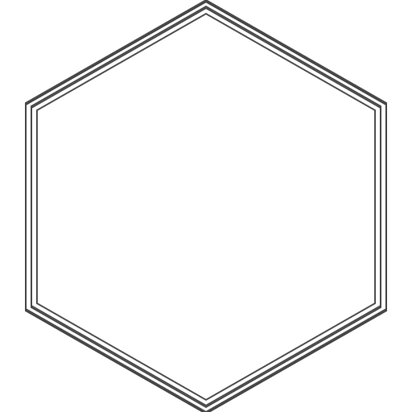

# 该仓库已废弃！MIN将于2.10版本后闭源！

# MIN(Minecraft in Netease)
一个完全免费开源的客户端软件

### 使用时的注意事项
1. 使用该产品即默认您接受该产品许可证(GNU AFFERO GENERAL PUBLIC LICENSE)
2. 使用者使用本产品造成的任何损失由使用者承担

### 对于有开发能力的开发者
请直接用在Windows系统环境下的IDE打开项目根目录
推荐Intellij IDEA，自动构建

## Made by FloatingPoint-MC <3

## 警告: MIN官方版隶属于FloatingPoint-MC组织且仅隶属于该组织。对于任何一切盗用、侵权行为，我们有权利追究其法律责任。